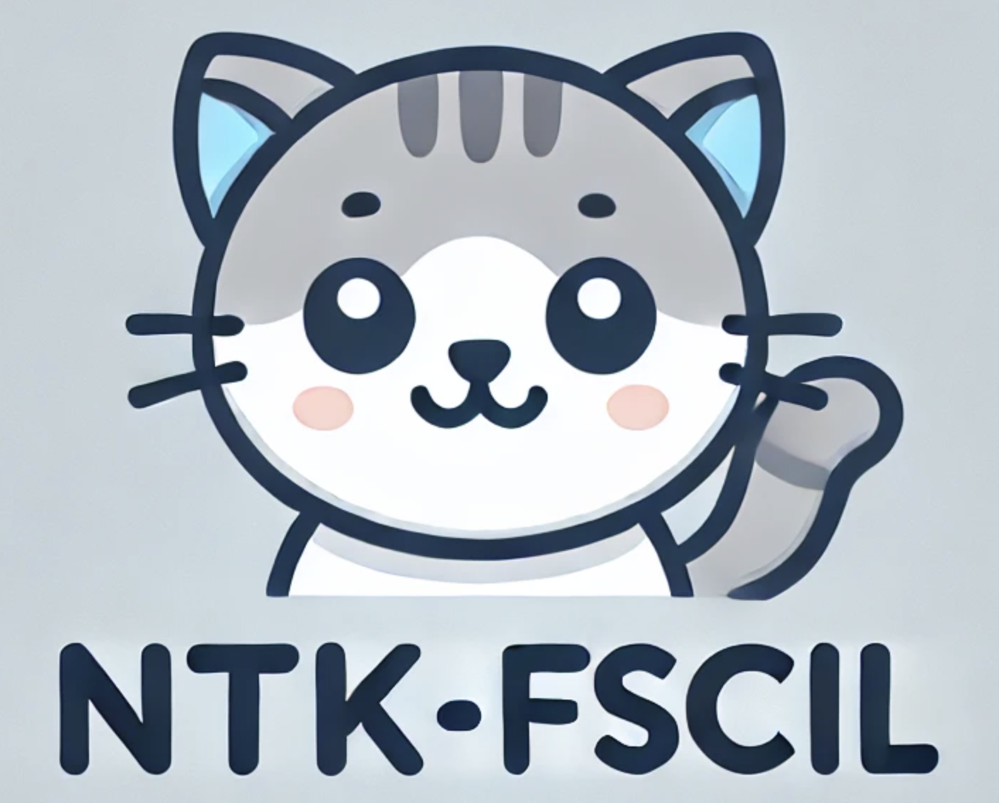
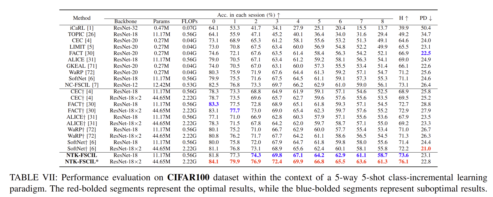

<p align="center">
Code and data for paper <a href="https://arxiv.org/abs/2403.12486">NTK-Guided Few-Shot Class Incremental Learning</a>  (Accept by IEEE TIP)
    </br>
    <div align="center">
      
    </div>
    </br>
    <div align="center">
        <a href="https://www.python.org/">
            
        </a>
        <a>
            
        </a>
    </div>
</p>

### 💫 Self-Supervised Pre-Training Weights

Before starting, it's crucial to understand these repositories in depth. Since these repositories are designed for 224x224 image sizes, you will need to adjust them for smaller images like CIFAR100, Mini-ImageNet, and ImageNet100 used in FSCIL (Few-Shot Class-Incremental Learning). After making the necessary modifications, proceed with self-supervised pre-training on the base session for each dataset. Train for 1000 epochs, ensuring effective convergence, and save the resulting pre-trained weights.

- **[MAE](https://github.com/facebookresearch/mae)**: Learns image representations by masking random patches of the input image and reconstructing the missing information.
- **[SparK](https://github.com/keyu-tian/SparK)**: Efficient pre-training that leverages sparsity for faster convergence and enhanced performance.
- **[DINO](https://github.com/facebookresearch/dino)**: A self-distillation framework where a student network learns from a teacher network to generate consistent features across views.
- **[MoCo-v3](https://github.com/facebookresearch/moco-v3)**: Momentum Contrast Learning's latest iteration, refining contrastive learning.
- **[SimCLR](https://github.com/sthalles/SimCLR)**: A simple yet effective framework for contrastive learning using image augmentations.
- **[BYOL](https://github.com/sthalles/PyTorch-BYOL)**: Learn effective representations without negative samples, focusing on mutual information maximization.

Using CIFAR100 as an example, we have open-sourced the pre-trained weights obtained from these self-supervised frameworks, covering various network architectures such as ResNet18, ResNet12, ViT-Tiny, and ViT-Small. The specific Google Drive download link is: https://drive.google.com/drive/folders/1RhyhZXETrxZqCkVb7UhQMIoQWZJqLogs?usp=drive_link. You can directly download the `pretrain_weights` folder and place it in the root directory of the project. Alternatively, you can choose to perform the pre-training yourself and adjust the corresponding path in the `load_self_pretrain_weights` function within the `utils.py` file.

## 🚀 Set Up
To run NTK-FSCIL from source, follow these steps:
1. Clone this repository locally
2. `cd` into the repository.
3. Run `conda create -n FSCIL python=3.8` to created a conda environment named `FSCIL`.
4. Activate the environment with `conda activate FSCIL`.
5. `pip install -r requirements.txt`

### 👋 Training and Testing

To get started, simply run the script using:

```bash
python cifar.py
```

The results on CIFAR-100 are presented as follows:
<p align="center">
    </br>
    <div align="center">
      
    </div>
    </br>
</p>

We have incorporated a variety of configurable settings to offer flexibility for future users. These include:

- **Datasets:** 
  - `cifar100`, `cub200`, `miniimagenet`, `imagenet100`, `imagenet1000`

- **Image Transformation Methods:** 
  - `Normal`, `AMDIM`, `SimCLR`, `AutoAug`, `RandAug`

- **Network Architectures:** 
  - `resnet12`, `resnet18`, `vit_tiny`, `vit_small`

- **Self-Supervised Pre-Trained Weights:** 
  - `dino`, `spark`, `mae`, `moco-v3`, `simclr`, `byol`

- **Alignment Losses:**
  - `curriculum`, `arcface`, `sphereface`, `cosface`, `crossentropy`

You can modify these settings directly in the command for customized experiments.

Note: We have removed the NTK constraint on the linear layers for content to be included in a future paper. Apologies for the inconvenience! However, this adjustment does not significantly impact performance and should not hinder further innovations based on this work.

## ✍️ Citation
If you find our work helpful, please use the following citations.
```

```

## 📰 License
MIT. Check `LICENSE.md`.
